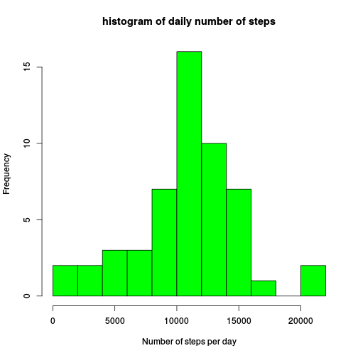
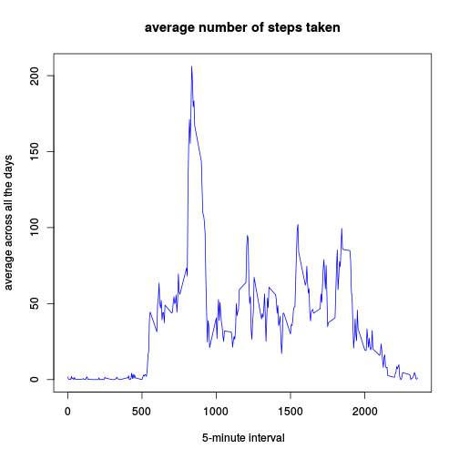
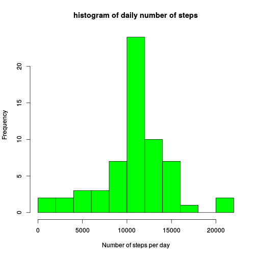
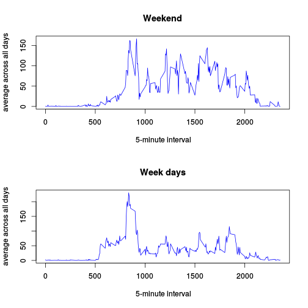

# Reproducible Research: Peer Assessment 1
It is now possible to collect a large amount of data about personal
movement using activity monitoring devices such as a
[Fitbit](http://www.fitbit.com), [Nike
Fuelband](http://www.nike.com/us/en_us/c/nikeplus-fuelband), or
[Jawbone Up](https://jawbone.com/up). These type of devices are part of
the "quantified self" movement -- a group of enthusiasts who take
measurements about themselves regularly to improve their health, to
find patterns in their behavior, or because they are tech geeks. But
these data remain under-utilized both because the raw data are hard to
obtain and there is a lack of statistical methods and software for
processing and interpreting the data.

This work makes use of data from a personal activity monitoring
device. This device collects data at 5 minute intervals through out the
day. The data consists of two months of data from an anonymous
individual collected during the months of October and November, 2012
and include the number of steps taken in 5 minute intervals each day.

## Loading and preprocessing the data

The variables included in this dataset are:

* **steps**: Number of steps taking in a 5-minute interval (missing
    values are coded as `NA`)

* **date**: The date on which the measurement was taken in YYYY-MM-DD
    format

* **interval**: Identifier for the 5-minute interval in which
    measurement was taken

The data is supposed to be located in the working directory with the name
activity.csv. The following R code loads the data in the variable `aData`

```r
aData = read.csv("activity.csv")
```


## What is mean total number of steps taken per day?
Computation of the total number of steps per day. The following R code loads
the data in the variable `dailyData`

```r
dailyData = tapply(aData$steps, aData$date, FUN = "sum", simplify = TRUE)
```


Histogram of the total number of steps taken each day

```r
# Plotting the histogram
hist(dailyData, nclass = 11, col = "green", main = "histogram of daily number of steps", 
    xlab = "Number of steps per day")
```

 


Calculation and report of the mean and median total number of steps taken per day
* Mean

```r
totalMean = mean(dailyData, na.rm = TRUE)
totalMean
```

```
## [1] 10766
```


* Median

```r
totalMedian = median(dailyData, na.rm = TRUE)
totalMedian
```

```
## [1] 10765
```


## What is the average daily activity pattern?
Computing the average across all days

```r
patternData = tapply(aData$steps, aData$interval, FUN = "mean", na.rm = TRUE, 
    simplify = TRUE)
```


Plotting the average daily activity pattern

```r
plot(names(patternData), patternData, type = "l", main = "average number of steps taken", 
    xlab = " 5-minute interval", ylab = "average across all the days", col = "blue")
```

 


Which 5-minute interval, on average across all the days in the dataset,
contains the maximum number of steps?

```r
names(patternData[patternData == max(patternData)])
```

```
## [1] "835"
```


## Imputing missing values
Calculate and report the total number of missing values in the dataset
(i.e. the total number of rows with `NA`s)

```r
sum(!complete.cases(aData))
```

```
## [1] 2304
```


Devise a strategy for filling in all of the missing values in the dataset:
using the mean for that 5-minute interval.

Create a new dataset that is equal to the original dataset but with the
missing data filled in.


```r
newData = aData
newData$steps[is.na(aData$steps)] = patternData[as.character(aData$interval[is.na(aData$steps)])]
```


Make a histogram of the total number of steps taken each day and Calculate and
report the mean and median total number of steps taken per day. Do these values
differ from the estimates from the first part of the assignment? What is the
impact of imputing missing data on the estimates of the total daily number of
steps?


Computation of the total number of steps per day

```r
newDailyData = tapply(newData$steps, newData$date, FUN = "sum", simplify = TRUE)
```


Histogram of the total number of steps taken each day

```r
# Plotting the histogram
hist(newDailyData, nclass = 11, col = "green", main = "histogram of daily number of steps", 
    xlab = "Number of steps per day")
```

 


Calculation and report of the mean and median total number of steps taken per
day

* Mean

```r
newTotalMean = mean(newDailyData)
newTotalMean
```

```
## [1] 10766
```


* Median

```r
newTotalMedian = median(newDailyData)
newTotalMedian
```

```
## [1] 10766
```


Comparison of the new mean with the estimates from the first part of the assignment

```r
if (newTotalMean == totalMean) {
    "There is no difference between the mean with NA and the mean without NA"
} else {
    "The new mean is different from the mean estimated without imputing the NA"
}
```

```
## [1] "There is no difference between the mean with NA and the mean without NA"
```


Comparison of the new median with the estimates from the first part of the
assignment

```r
if (newTotalMedian == totalMedian) {
    "There is no difference between the median with NA and the median without NA"
} else {
    "The new median is different from the median estimated without imputing the NA"
}
```

```
## [1] "The new median is different from the median estimated without imputing the NA"
```


What is the impact of imputing missing data on the estimates of the total daily
number of steps?

The imputing operation fills in the days with all values missing, and end
increase the total of days with some values missing.


## Are there differences in activity patterns between weekdays and weekends?
splitting the dataset into weekdays and weekend

```r
weekend = (weekdays(as.Date(newData$date)) %in% c("Saturday", "Sunday"))
weekendData = newData[weekend, ]
weekdayData = newData[!weekend, ]
```


Computing the average across all days

```r
weekendPattern = tapply(weekendData$steps, weekendData$interval, FUN = "mean", 
    na.rm = TRUE, simplify = TRUE)

weekdayPattern = tapply(weekdayData$steps, weekdayData$interval, FUN = "mean", 
    na.rm = TRUE, simplify = TRUE)
```


Plotting

```r
par(mfrow = c(2, 1))
plot(names(weekendPattern), weekendPattern, type = "l", main = "Weekend", xlab = " 5-minute interval", 
    ylab = "average across all days", col = "blue")
plot(names(weekdayPattern), weekdayPattern, type = "l", main = "Week days", 
    xlab = " 5-minute interval", ylab = "average across all days", col = "blue")
```

 


There is a sensible difference in activity patterns between weekdays and
weekends. The subject tends to be most active diuring weekends.
